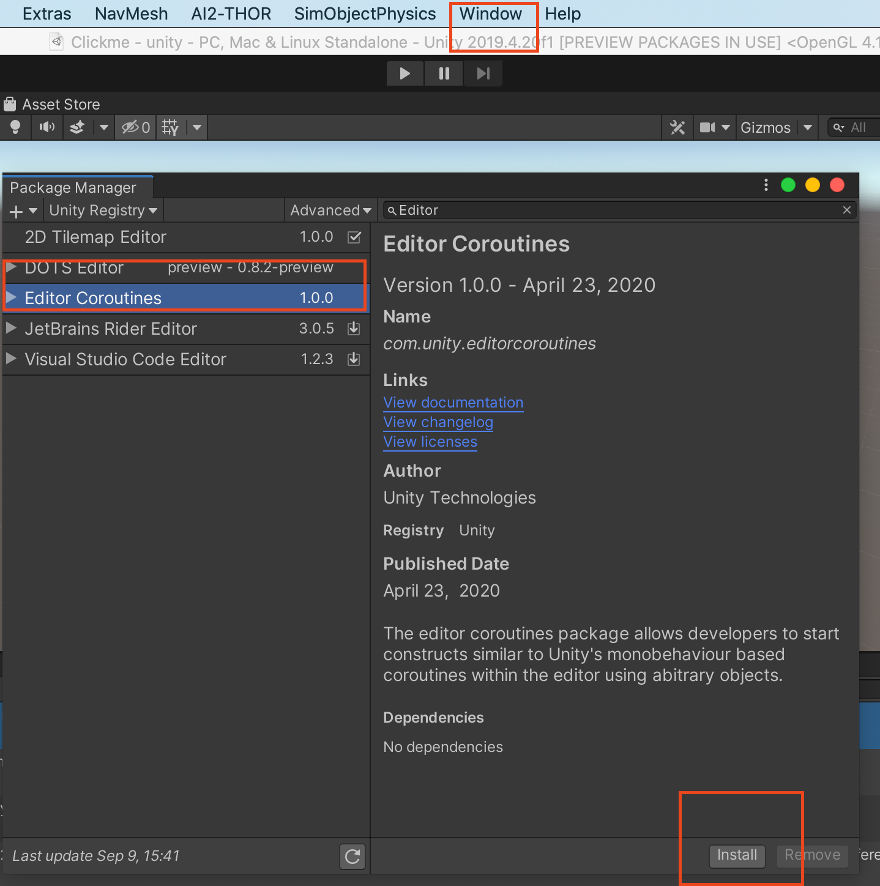
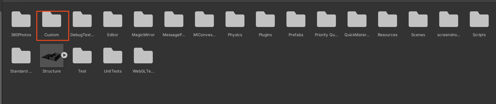
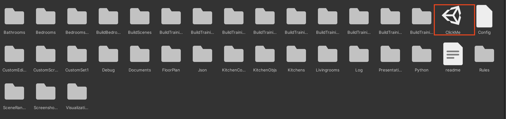
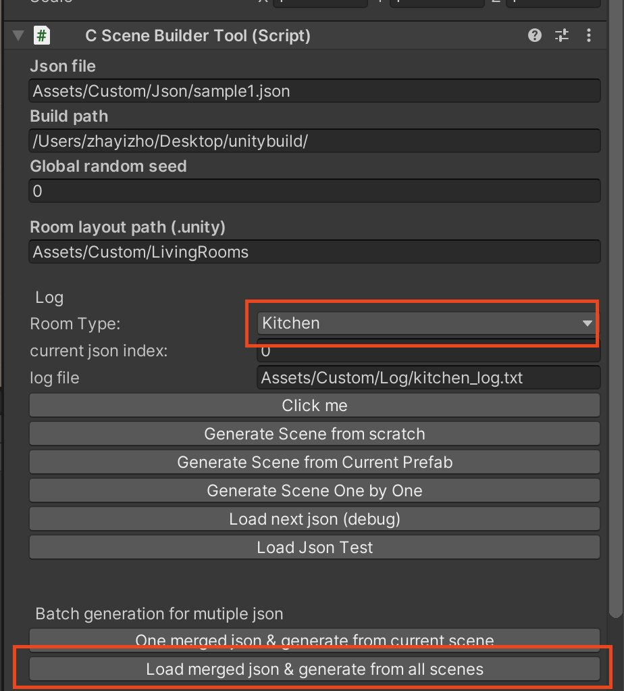

## Quickstart

Follow the instruction to generate indoor scene by CSSG on Unity Editor

1. Clone AI2Thor version 3.3.5:
```bash
$ git clone https://github.com/allenai/ai2thor
$ git checkout 323f5172bda38a662de59a876c5055c9b3a07aa4
$ cd ai2thor/unity/Assets 
```

2. Clone the **Custom** folder into *unity/Assets/*

3. Add EditorCoroutine dependencies in UnityEditor:
3.1. Go to menu **Window** and open **Package Manager**
3.2. Search for package **EditorCoroutine** and click **install**



# (Optional) For better experience, you modify some code in ai2thor:
0.1. for Assets/Scripts/InstantiatePrefabTest.cs: commment the angle checkpart when placing object

Comment start from line 367: //now to do a check to make sure the sim object is contained within the Receptacle box, and doesn't have
Comment end from line line 433: // set true if we want objects to be stationary when placed. (if placed on uneven surface, object remains stationary)

(The line number may vary for different version of ai2thor)
0.2. Assets/Scripts/PhysicsRemoteFPSAgentController.cs: comment some line to disable object always place upright

Comment start line 4397:// check if the object should be forced to only check upright placement angles (this prevents things like Pots being placed sideways)
//if (ReceptacleRestrictions.AlwaysPlaceUpright.Contains(handSOP.ObjType)) {
//    placeUpright = true;
//}
Comment end line 4402: // ok we are holding something, time to try and place it

4. Follow the image instructions to generation one scene from one CDF:

In Luminous, we provide 120 scene structures for scene generation, the image above points out the location of the empty scene prefabs (scene structures). 


You may choose any of the one scenes from the folders (livingrooms/bedrooms/kitchens/bathrooms); then open it


Get the **HelperTool** prefab in the *Custom/SceneRandomizer/* folder and drag it into the scene hierarchy


Then, (1) click the scene builder; (2) fill in the path of your cdf file (we provide some samples in the *Custom/Json* folder); (3) Set a random seed as you like; (4) choose the correct room type suggested in the cdf and choose whether to generate drawer/shelf/cabinet (default false for better experience) (4) Click buttons **Load Json...** and **Generate Scene from current prefab** to generate one scene under current cdf this scene structure.


If the **Console** log prints *successfully generated objects and furniture*, the scene will be saved in **BuildScenes**.


5. Follow the image instructions to generate scenes from CDF:


First, locate the **clickme.unity** scene file and select the **SceneBuilder** in the game view



Then, select the **room type** in the inspector and click **Load merged json \& generate from all scenes** button to generate scenes based on CDFs.


The generated scenes are saved into **Custom/BuildScenes/**.


## Algorithms

|   Algorithm   | Scene Graph Inference | Scene Generation | Constrained | RGBD rendering |
|:-------------:|:---------------------:|:----------------:|:-----------:|:--------------:|
|     PlanIT    |           ✓           |         x        |      x      |        x       |
|     Grains    |           x           |         ✓        |      ✓      |        ✓       |
|     3DSLN     |           x           |         ✓        |      ✓      |        ✓       |
| Human-Centric |           x           |         ✓        |      x      |        x       |
|      CSSG     |           ✓           |         ✓        |      ✓      |        ✓       |


Following algorithms original based on [SUNCG](https://sscnet.cs.princeton.edu/) have been implemented in this repository on [3D-Front](https://arxiv.org/abs/2011.09127):
- [Grains (Generative Recursive Autoencoders for INdoor Scenes)](https://arxiv.org/pdf/1807.09193.pdf)
<!-- - [PlanIT (planning and instantiating indoor scenes with relation graph and spatial prior networks)](https://dl.acm.org/doi/pdf/10.1145/3306346.3322941) -->
- [3D-SLN (End-to-End Optimization of Scene Layout)](http://3dsln.csail.mit.edu/papers/3dsln_cvpr.pdf)
- [ST-AOG (Human-centric Indoor Scene Synthesis Using Stochastic Grammar)](https://arxiv.org/pdf/1808.08473.pdf)


